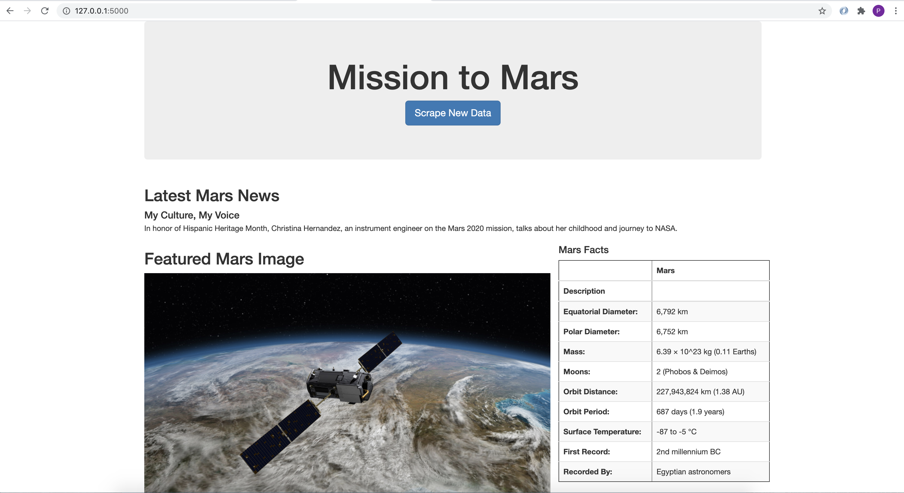

# Challenge10_Mission-to-Mars

In this module, we are helping Robin on web-scraping for information of Mars. In this project, data was scraped from the official website of NASA, and the final portfolio was obtained and displayed in local flask disk. 

## Summary:
* Portfolio for Mars is created and is shown below. 
* 
* 

## Resources:
* Data was scraped from https://mars.nasa.gov/news/ and https://astrogeology.usgs.gov/search/results?q=hemisphere+enhanced&k1=target&v1=Mars
